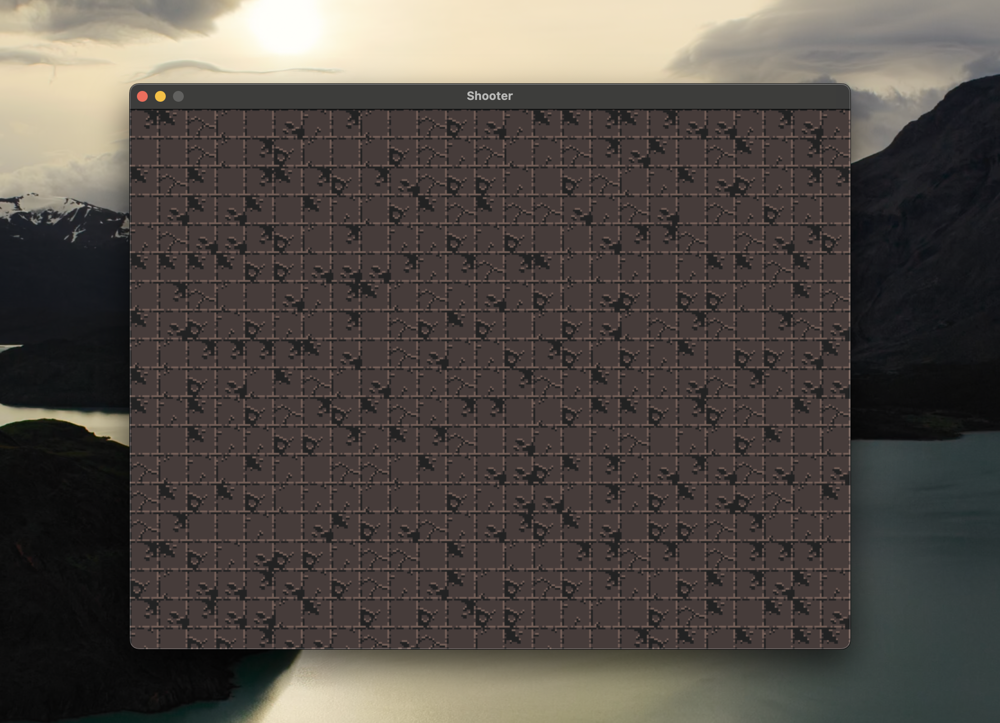

# Shooter Game README
## Lord Augustus Aurelius Foxwell

## Project Overview

Welcome to the **Shooter Game** project! This project guides you through building a dynamic shooter game using **Python** and **Pygame**, leveraging **Object-Oriented Programming (OOP)** principles and your understanding of Python fundamentals! 

In this game, you'll control a player who can move around the screen, shoot bullets at enemies, collect coins and gain experience points (XP). As we extend features, you could consider adjusting the enemy spawn rate, leveling up with XP, weapon upgrades etc.
The game also features a health system, knockback mechanics, 


---

## 1. Understanding What We’re Building

We’re developing a **Shooter Game** using **Python** and **Pygame**. The game includes the following features:

- **Player Movement**: Navigate the player around the screen using keyboard inputs.
- **Shooting Mechanics**: Fire bullets towards the mouse position or the nearest enemy.
- **Enemies**: Spawn enemies that chase the player. Enemies can be knocked back upon collision.
- **Coins**: Collect coins dropped by defeated enemies to gain XP.
- **Experience Points (XP) & Levels**: Gain XP to level up and choose upgrades.
- **Upgrade Menu**: Select upgrades that enhance player abilities upon leveling up.
- **Health System**: Manage player health with visual indicators.
- **Game Over Screen**: Display a game over screen with options to restart or quit.

The project emphasises understanding and applying **Object-Oriented Programming (OOP)** concepts to create a clean, maintainable, and scalable codebase.

---

# Feature I: PyGame Window
Follow these steps to create the game window for your shooter game using PyGame.

## 1. Installations
First install PyGame with the following command in your terminal:
```bash
pip3 install pygame
```

## 2. Defining the Game Class
The Game class will act as the main controller for the game. It encapsulates all major game logic, including the game loop, event handling, rendering, and updating the game state.

The Game class will be responsible for managing everything in the game, including:
- Handling player input (keyboard/mouse)
- Updating game objects
- Drawing game elements on the screen

The code should look like this: 
```python
class Game:
    def __init__(self):
        pygame.init()  # Initialize Pygame

        # TODO: Create a game window using Pygame
        # self.screen = ?

        # TODO: Set up the game clock for frame rate control
        # self.clock = ?

        # TODO: Load assets (e.g., fonts, images)
        # self.font_small = ?

        # TODO: Set up game state variables
        # self.running = True

        # TODO: Create a random background
        # self.background = ?
        
    def reset_game(self):
        self.game_over = False

    def create_random_background(self, width, height, floor_tiles):
        bg = pygame.Surface((width, height))
        tile_w = floor_tiles[0].get_width()
        tile_h = floor_tiles[0].get_height()

        for y in range(0, height, tile_h):
            for x in range(0, width, tile_w):
                tile = random.choice(floor_tiles)
                bg.blit(tile, (x, y))

        return bg

    def run(self):
        while self.running:
            pass
            # TODO: Set a frame rate limit
            # self.clock.tick( ? )

            # TODO: Handle player input and events
            # self.handle_events()

            # TODO: Update game objects
            # self.update()

            # TODO: Draw everything on the screen
            # self.draw()

        pygame.quit()

    def handle_events(self):
        """Process user input (keyboard, mouse, quitting)."""

        for event in pygame.event.get():
            pass
            # TODO: Allow the player to quit the game
            # if event.type == ?:
            #     self.running = False

    def update(self):
        """Update the game state (player, enemies, etc.)."""
        pass

    def draw(self):
        """Render all game elements to the screen."""
        pass
        # TODO: Draw the background
        # self.screen.blit(?, (0, 0))

        # TODO: Draw player, enemies, UI elements

        # Refresh the screen
        pygame.display.flip()
```
### 2.1. Constructor
In game.py, modify the initialiser (__init__) or Constructor to include the following:

- Initialise PyGame.
- Creates a game window.
- Sets up a game loop controller (`self.running`).
- Loads necessary assets (such as fonts and images).

Refer to the canvas pages and complete the missing sections in the __init__ method.

### 2.2. Event Handling
The `handle_events()` method should:
- Capture keyboard/mouse input
- Allow players to quit the game

### 2.3. Draw
The draw() method will: 
- Render the background
- Draw player, enemies, and UI elements
- Refresh the display to show changes

### 2.4. Game Loop 
The `run()` method contains the game loop.
Inside your `run` method, remove the `pass` keyword. This method should include the following: 
- A while loop to run PyGame continuously
- Controls the frame rate for smooth gameplay
- Calls functions to handle events, update game logic, and draw the screen. 
- Ends the game properly when the player quits

Note: The update() method currently does nothing as we will implement the updating game-logic down the line. 

### 2.5. Exeucting Game
If we execute the Python script with `python3 main.py`, you should have a PyGame window appear: 



---
